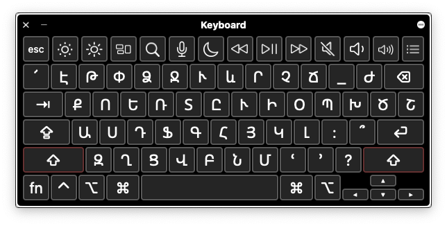
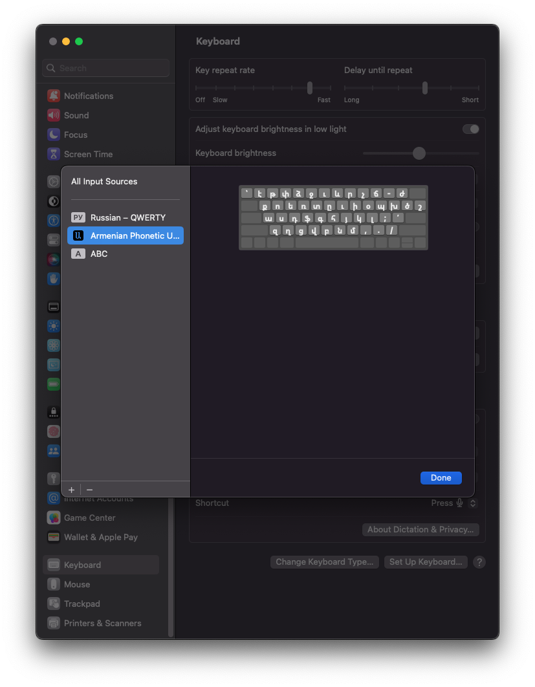

# Armenian Phonetic Unicode Keyboard for macOS

#### macOS doesn't provide an Armenian Phonetic Unicode keyboard by default, so I've decided to fix that.

 

## Making Armenian Phonetic Unicode Keyboard

#### For the first, I've made the "Armenian Phonetic Unicode.bundle" custom keyboard by Ukelele (Ukelele is a Unicode Keyboard Layout Editor for macOS) which contains both keyboards uppercase and lowercase:

 

#### **Note:** the custom keyboard has the same layout as the Armenian keyboard of KDWin.

 

## Creating Installation Automated Task

#### For the second, I've created the "installer.app" automated task by Automator (Automator is a Workflows Creator of Automating Repetitive Tasks for macOS) to install the custom keyboard automatically. So, you don't need to install it manually or install Ukelele on your machine to install the custom keyboard, just run the "installer.app". Moreover, the automated task will automatically add the custom keyboard as an Input Source.

 

## Installing Armenian Phonetic Unicode Keyboard

#### To install the custom keyboard follow the instructions or the video by the URL: https://youtu.be/OROlAIoLwAo

* **Step 1:** Clone the repository in the Downloads folder (you must locate the repository in the Downloads folder, since the "installer.app" uses it as the base folder)
* **Step 2:** Run the "installer.app" automated task and enter your password to allow access to the "Macintosh HD > Library" folder
* **Step 3:** Log Out and Log In or Restart your machine

#### To make sure that the custom keyboard was installed and added as an Input Source choose Apple menu  > System Settings. Then click Keyboard  in the sidebar and in the Text Input section on the right, click Edit. So, as you can see there was installed and added Armenian Phonetic Unicode keyboard as an Input Source:

## Uninstalling Armenian Phonetic Unicode Keyboard

#### To uninstall the custom keyboard follow the instructions:

* **Step 1:** Delete "Armenian Phonetic Unicode.bundle" file from "Macintosh HD > Library > Keyboard Layouts" folder
* **Step 1:** Log Out and Log In or Restart your machine